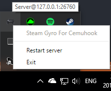
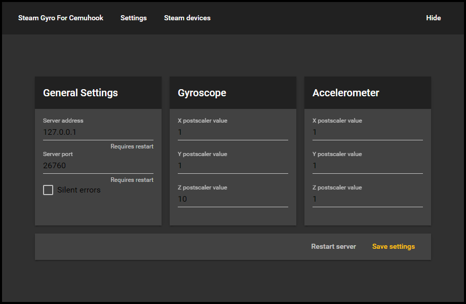
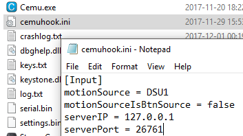

## Note: 
* Project is archived from **2022-03-06** onwards
* SteamDeck is not supported, however for more info check https://github.com/FrogTheFrog/steam-gyro-for-cemuhook/issues/47

----

# Play your favorite CEMU games with your Steam Controller's GYRO!

## Requirements

* Cemu emulator.
* Cemuhook with motion source support.
* Steam Controller.

## Download

Download release [here](https://github.com/FrogTheFrog/steam-gyro-for-cemuhook/releases).

## Before playing  

Make sure that Steam Controller configuration has gyro disabled in places where actual WiiU motion sensor would be used! Might cause undesired effects otherwise.

## How to use

Drag executable anywhere you want and launch it. If you right click on tray icon it will allow you to restart server or exit. Moreover, it will show server address and port on hover:

A settings file will be created in the same directory. If you left-click on tray icon, it will open a simple UI where you can edit server settings or apply filter for motion data in real time:

If you have changed default server IP or port, you will also need to change it in `cemuhook.ini` under `Input`:

Finally, go to Cemu and make sure motion source is selected:

## Headless mode

App can be started in a headless mode of some sort. In this mode the UI will never be instantiated. This mode can be enabled by a hidden setting in generated configuration file. 

## Icon

The icon is licensed to me, so keep that in mind.

# Credits

* Huge credits must be given to [kolrabi](https://github.com/kolrabi/steamcontroller). This project is mostly based on information that they collected about HID.
* Thank you [rajkosto](https://github.com/rajkosto/DS4Windows) for providing tips and source code for UDP server.
