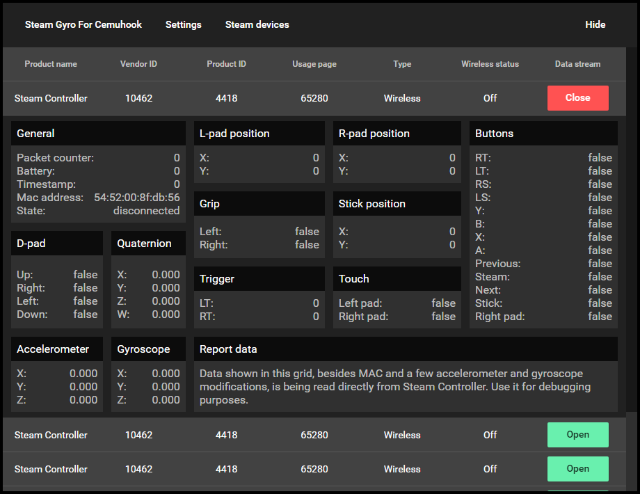

# Play your favorite CEMU games with your Steam Controller's GYRO!

## Requirements

* Cemu emulator.
* Cemuhook with motion source support.
* Steam Controller.

## Download

Download release [here](https://github.com/FrogTheFrog/steam-gyro-for-cemuhook/releases).

## Before playing  

Make sure that Steam Controller configuration has gyro disabled in places where actual WiiU motion sensor would be used! Might cause undesired effects otherwise.

## How to use

Drag executable anywhere you want and launch it. You **should** see (Windows might sometimes decide not to show it) similar notification if everything started successfully:

If you right click on tray icon it will allow you to restart server or exit. Moreover, it will show server address and port on hover:

A settings file will be created in the same directory. If you want, you can change server address, port and click restart on tray. Or you can left-click on tray icon which will open a simple UI where you can edit settings in real time:

UI also allows to connect to other Steam Controllers and observe their data stream:

If you have changed default server IP or port, you will also need to change it in `cemuhook.ini` under `Input`:

Finally, go to Cemu and make sure motion source is selected:

## Icon

The icon you see in image above is licensed, thus I am not allowed to share it.

# Credits

* Huge credits must be given to [kolrabi](https://github.com/kolrabi/steamcontroller). This project is mostly based on information that he/she/it collected about HID.
* Thank you [rajkosto](https://github.com/rajkosto/DS4Windows) for providing tips and source code for UDP server.
